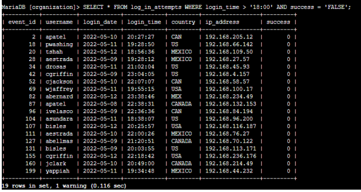
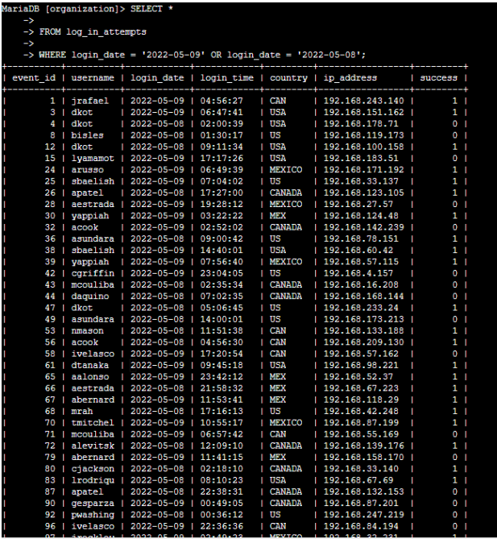
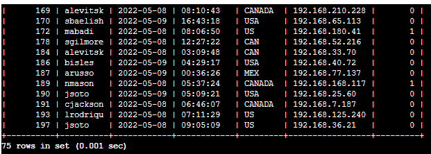
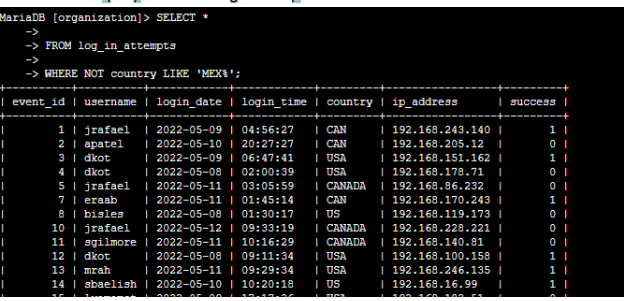
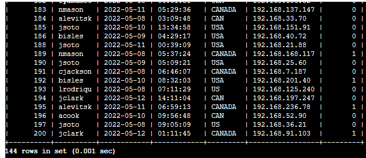
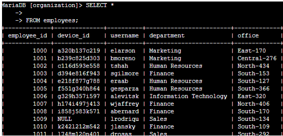
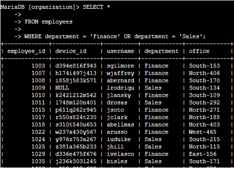
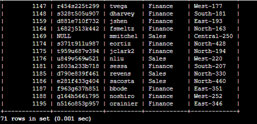
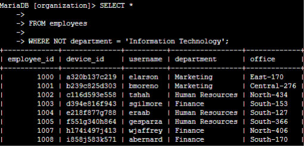
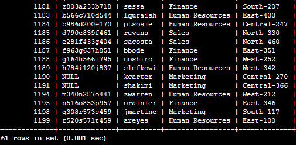

# Apply filters to SQL queries

## Project description

The management at my organization has asked me to investigate potential security issues and update employee computers as required. As a Linux administrator, I used SQL with filters toperform security-related tasks.

## Retrieve after hours failed login attempts

There were suspicious activities that occurred after business hours (after 18:00). All after hours login attempts that failed need to be investigated.
I created a SQL query on MariaDB to filter for failed login attempts thatoccurred after business hours.

The result is based on the `log_in_attempts` table where the `login_time` column is after `18:00` and the login attempts are failed (`0`). The filter `“Select * “` means to select everything (all columns) and FROM `log_in_attempts` means it is from the `log_in_attempts` table. Success indicates the status of the login. If it is zero, it is a failure whereas if it is one, it is a success. Therefore, there were 19 failed login attempts after `18:00`.

## Retrieve login attempts on specific dates

A suspicious event occurred on `2022-05-09`. Any login activity that happened on `2022-05-09` or on the day before needs to be investigated. Therefore, I created a SQL query to filter for login attempts that occurred on specific dates.

I selected the `log_in_attempts` table and used the `WHERE` clause and `OR` operator to filter my results to output only login attempts that occurred on `2022-05-05` or `2022-05-08`. As a result, there were 75 login attempts in these two days.

## Retrieve login attempts outside of Mexico

After investigating the data and following the pattern, there is a strong indication that login attempts outside of Mexico should be investigated. I created a SQL query to filter for login attempts that occurred outside of Mexico.

I used the `WHERE` clause and `NOT` operator to filter the outputs and receive the login attempts outside Mexico. However, the word “Mexico” could be “Mex”, “MEX”, and etc. To simplify this, I chose `LIKE` with `MEX%` as the pattern to match as MEX and MEXICO. The `%` sign indicates any unspecified characters when used with LIKE. As a result, there were 144 login attempts outside Mexico.

## Retrieve employees in Marketing

My team wants to update certain computers across departments. I created a SQL query to filter for employee machines from employees in the Marketing department in the East building.

I first selected all the data in the `employee` table and used the `WHERE` clause to filter employees who are part of the marketing team and reside in the east building using `AND` and `LIKE` operators. As a result, there are 7 employees who match the criteria.

## Retrieve employees in Finance or Sales

Across departments, plenty of employee data needs to be updated. I created a SQL query to filter for employee machines from employees in the Finance or Sales departments.

I selected the Finance department and Sales department. By using the `WHERE` clause and `OR` operator I filtered the outputs to make sure all employees who are members of both departments are listed. As a result, there are 71 people who happen to be members of both departments.

## Retrieve all employees not in IT

I created a SQL query to filter for employee machines from employees notin the `Information Technology` department.

First, I started by selecting all data from the `employee` table. Then, I used a `WHERE` clause with `NOT` to filter for employees not in the IT department.

## Summary

I applied filters to SQL queries to get specific information on `employee` and `log_in_attempts` tables. I used the `AND`, `OR`, `NOT` operators to filter for the specific information and I used `LIKE` and the `(%)` sign filter for patterns.
